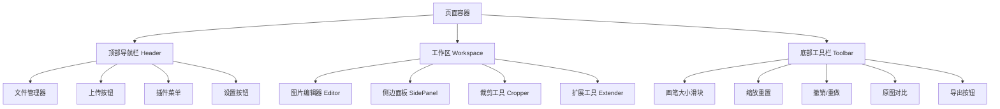

# 媒体资源处理工具箱 - 产品需求文档（PRD）

## 1. 产品概述

### 1.1 产品定位
一款轻量级Web端媒体资源处理工具箱，面向自媒体、教育、电商等行业用户，提供图片/视频基础编辑、特效处理、格式优化等功能，满足"快速修图+即时分享"的核心诉求。

### 1.2 产品愿景
通过Web技术实现零安装、低门槛的媒体处理工具，将用户的核心编辑路径（上传图片 → 调整 → 导出）控制在3~4个关键操作内，让用户能够快速完成图片编辑并即时分享。

### 1.3 开发背景
- **业务背景**：融合媒体快速发展，内容生产场景多元化，传统客户端软件操作门槛高、适配性差
- **技术背景**：AI编程助手成熟，可大幅提升开发效率
- **时间约束**：4小时竞赛开发周期

## 2. 目标用户

### 2.1 主要用户群体
- **自媒体创作者**：需要快速处理图片用于社交媒体发布
- **教育工作者**：制作课件、教学素材需要图片编辑
- **电商运营**：商品图片处理、水印添加等

### 2.2 用户特征
- 非专业设计师，需要简单易用的工具
- 追求快速处理，不希望学习复杂软件
- 主要在移动端、Web端使用

## 3. 产品目标

### 3.1 业务目标
- 当前版本聚焦**图片编辑与导出**，保证裁剪、特效、优化等核心流程顺畅
- 满足"快速修图+即时分享"核心诉求
- 核心编辑流程（上传图片 → 编辑 → 导出）的关键操作控制在3~4步

### 3.2 技术目标
- 4小时内完成核心功能开发及基础UI搭建
- 借助AI编程助手快速生成核心逻辑代码
- 交付可运行Web应用

### 3.3 成功指标
- 功能完整性：**图片编辑相关核心功能（裁剪、旋转/缩放、特效处理、压缩导出）100%实现**，详细评分规则见第9章
- 性能指标：预览延迟≤0.5秒，大文件处理无崩溃
- 兼容性：Chrome、Edge完美运行，适配主流分辨率
- 扩展能力：视频弹幕互动、音频可视化作为P1扩展功能，不影响图片编辑主流程

## 4. 功能需求

### 4.1 核心功能模块（P0 - 必实现）

#### 4.1.1 图片处理工具集

##### FR-1.1 裁剪功能

**FR-1.1.1 比例裁剪**
- **需求描述**：提供8种预设比例，支持一键切换
- **比例列表**：
  - 3:4（竖版短视频）
  - 21:9（电影屏）
  - 4:5（小红书封面）
  - 1:2（长条图）
  - 9:16（抖音封面）
  - 1:1（正方形）
  - 4:3（常规）
  - 16:9（宽屏）
- **交互要求**：
  - 切换比例后裁剪框实时适配图片尺寸
  - 比例切换时自动居中裁剪框
  - 鼠标悬浮比例选项时显示场景提示（如"4:5-小红书封面"）

**FR-1.1.2 自由裁剪**
- **需求描述**：支持用户自定义裁剪区域
- **交互能力**：
  - 裁剪框支持鼠标拖拽边缘/角点缩放
  - 拖拽框内区域可平移
  - 裁剪框内实时显示当前选中区域的宽高像素值

**FR-1.1.3 裁剪历史**
- **需求描述**：记录裁剪操作历史，支持撤销重做
- **功能要求**：
  - 记录最近5次裁剪操作
  - 支持撤销（Undo）和重做（Redo）操作

##### FR-1.2 旋转与翻转

**FR-1.2.1 固定角度旋转**
- **需求描述**：提供快速旋转功能
- **功能要求**：
  - 支持0°/90°/180°/270°一键旋转
  - 提供"旋转重置"按钮，一键恢复图片初始角度
  - 新增角度输入框，支持手动输入0-360°任意整数角度
  - 输入后点击"应用"实时生效
  - 输入非法值（负数、小数）时弹窗提示

**FR-1.2.2 细粒度旋转**
- **需求描述**：提供精确角度控制
- **功能要求**：
  - 旋转滑块范围0-360°
  - 拖动过程中图片实时跟随旋转
  - 滑块旁显示当前角度值
  - 支持鼠标点击滑块任意位置快速跳转角度

**FR-1.2.3 翻转功能**
- **需求描述**：支持图片翻转
- **功能要求**：
  - 支持水平翻转
  - 支持垂直翻转
  - 提供一键还原操作

##### FR-1.3 缩放与尺寸调整

**FR-1.3.1 比例缩放**
- **需求描述**：提供缩放控制功能
- **功能要求**：
  - 提供0.1-5.0倍缩放滑块（步长0.1）
  - 同步显示缩放倍数输入框（支持手动输入0.1-5.0的小数）
  - 滑块与输入框联动（修改其一，另一自动同步）

**FR-1.3.2 鼠标交互缩放**
- **需求描述**：支持鼠标滚轮缩放
- **功能要求**：
  - 滚轮向上滚动时图片放大（每次滚动递增0.1倍）
  - 滚轮向下滚动时图片缩小（每次递减0.1倍）
  - 缩放后图片最小尺寸不小于100×100px
  - 最大尺寸不超过原图尺寸的5倍
  - 超出限制时弹窗提示

#### 4.1.2 特效处理模块

##### FR-2.1 马赛克功能

**FR-2.1.1 选区类型**
- **需求描述**：支持多种选区方式
- **功能要求**：
  - 矩形选区
  - 圆形选区
  - 自由手绘选区（鼠标长按拖拽绘制任意形状，松开后闭合选区）
  - 多边形选区（点击图片生成顶点，双击最后一个顶点闭合选区，支持最多20个顶点）
  - 选区切换按钮图标化展示，点击切换

**FR-2.1.2 选区操作**
- **需求描述**：支持选区编辑和管理
- **功能要求**：
  - 选中已创建的选区后，支持拖拽移动位置
  - 支持拖拽边缘/顶点调整大小
  - 右键点击选区弹出"删除""隐藏"选项
  - 隐藏后选区变为半透明虚线，便于查看图片背景

**FR-2.1.3 参数调节**
- **需求描述**：支持马赛克效果参数调整
- **功能要求**：
  - 模糊度滑块（0-100）
  - 马赛克颗粒大小滑块（1-20像素，值越大颗粒越粗）
  - 两个参数独立调节，实时预览效果

##### FR-2.2 滤镜效果

**FR-2.2.1 基础滤镜库**
- **需求描述**：提供丰富的滤镜效果
- **滤镜列表**（13种）：
  - 复古
  - 清新
  - 黑白
  - 高饱和
  - 胶片（模拟胶卷质感）
  - 日系（低饱和、高亮度）
  - 冷色调（偏蓝绿）
  - 暖色调（偏红黄）
  - 怀旧（泛黄复古）
  - 柔光（降低对比度，增加亮度）
  - 锐化（增强边缘细节）
  - 去雾（提升清晰度，减少朦胧感）
- **交互要求**：
  - 以图标+文字形式展示
  - 鼠标悬浮滤镜图标时，图片实时预览该滤镜效果（预览不影响当前编辑状态）
  - 点击后应用效果

**FR-2.2.2 滤镜参数调节**
- **需求描述**：支持滤镜强度控制和混合
- **功能要求**：
  - 每个滤镜新增"强度滑块"（0-100%，100%为默认效果）
  - 调节后实时更新效果
  - 支持同时叠加2种滤镜（如"复古+柔光"）
  - 叠加后显示"已叠加[滤镜1]+[滤镜2]"
  - 可点击"移除"按钮取消其中一种滤镜

**FR-2.2.3 自定义滤镜**
- **需求描述**：支持保存和应用自定义滤镜预设
- **功能要求**：
  - 调节好滤镜强度或混合效果后，点击"保存预设"
  - 输入预设名称（如"小红书风格"）
  - 可保存最多5组自定义预设
  - 预设列表以卡片形式展示
  - 支持重命名、删除预设
  - 点击预设卡片即可一键应用保存的滤镜效果

##### FR-2.3 文字水印

**FR-2.3.1 基础样式设置**
- **需求描述**：支持文字水印基础设置
- **功能要求**：
  - 支持中英文、数字及特殊字符输入
  - 输入框实时显示水印预览
  - 支持最大输入长度10字符，超出时提示"文字过长，请精简"
  - 颜色选择支持色板点击、十六进制代码输入（如#FF0000）、RGB值输入
  - 透明度滑块（0-100%，0%为完全透明，100%为不透明）
  - 实时预览水印透明度效果

**FR-2.3.2 位置与对齐**
- **需求描述**：支持水印位置控制
- **功能要求**：
  - 固定位置：居中、左上、右上、左下、右下（5个位置）
  - 点击位置选项后水印实时跳转
  - 针对固定位置，新增"边距输入框"（10-50像素）
  - 如"右上"位置可设置"距右20px、距上15px"

**FR-2.3.3 高级样式扩展**
- **需求描述**：支持水印高级样式
- **功能要求**：
  - 支持添加文字背景色（颜色选择同文字颜色）
  - 背景透明度独立调节（0-100%）
  - 文字平铺：设置横线&倾斜，调整平铺间距大小

##### FR-2.4 色彩调节

**FR-2.4.1 亮度调节**
- **需求描述**：支持图片亮度调整
- **功能要求**：
  - 滑块范围0-200%（100%为原图亮度）
  - 低于100%降低亮度，高于100%提升亮度
  - 调节时实时显示"亮度：XX%"

**FR-2.4.2 对比度调节**
- **需求描述**：支持图片对比度调整
- **功能要求**：
  - 滑块范围0-200%（100%为原图对比度）
  - 低于100%降低对比度（画面更灰）
  - 高于100%提升对比度（明暗差异更明显）

**FR-2.4.3 饱和度调节**
- **需求描述**：支持图片饱和度调整
- **功能要求**：
  - 滑块范围0-200%（100%为原图饱和度）
  - 0%为黑白效果
  - 高于100%增强色彩鲜艳度

**FR-2.4.4 色温调节**
- **需求描述**：支持图片色温调整
- **功能要求**：
  - 滑块范围0-200%（100%为原图色温）
  - 低于100%偏冷色（蓝绿色调）
  - 高于100%偏暖色（红黄色调）
  - 新增"冷色""暖色""默认"三个快捷按钮，一键切换常用色温

#### 4.1.3 图片优化

##### FR-3.1 压缩优化

**FR-3.1.1 压缩控制**
- **需求描述**：支持图片压缩功能
- **功能要求**：
  - 0-100%压缩率滑块（0%为无压缩，100%为最大压缩）
  - 滑块旁实时显示"当前压缩率：XX%"
  - 提供3个压缩档次按钮，与滑块联动：
    - 高清晰：10-30%压缩率（适合需保留细节的场景，如产品图）
    - 平衡：30-60%压缩率（兼顾清晰度与体积，如公众号配图）
    - 体积优先：70-100%压缩率（优先减小体积，如缩略图、表情包）
  - 压缩效果要求：
    - 1MB图片压缩后≤300KB
    - 5MB图片压缩后≤1.5MB

**FR-3.1.2 实时反馈**
- **需求描述**：提供压缩过程反馈
- **功能要求**：
  - 压缩前显示原图大小（如"原图大小：2.4MB"）
  - 调节压缩率时实时显示"预估压缩后大小：XXKB/MB"
  - 压缩完成后，弹窗显示"压缩前后对比"
  - 对比信息包含：原图大小、压缩后大小、压缩率（如"压缩率：75%"）
  - 支持"重新压缩"或"确认导出"操作

##### FR-3.2 导出功能

**FR-3.2.1 导出设置**
- **需求描述**：支持多种导出质量选项
- **功能要求**：
  - 导出时可选择"默认质量""高质量""低质量"
  - 确保导出文件符合需求

**FR-3.2.2 导出确认**
- **需求描述**：导出前提供确认和文件信息
- **功能要求**：
  - 导出前弹窗显示"确认导出"
  - 包含文件名、格式、预计大小
  - 支持修改文件名后再导出
  - 导出文件自动下载到浏览器默认下载目录
  - 下载完成后显示"下载成功"提示

### 4.2 扩展功能模块（P1 - 可选实现）

#### FR-4.1 视频弹幕互动

**FR-4.1.1 弹幕添加**
- **需求描述**：支持在视频上添加弹幕
- **功能要求**：
  - 自定义文字、颜色、字体、滚动速度
  - 提供三种模式：顶部固定、底部固定、滚动

**FR-4.1.2 弹幕互动**
- **需求描述**：支持弹幕回复功能
- **功能要求**：
  - 对已有弹幕点击"回复"后，输入内容可作为"子弹幕"跟随原弹幕显示
  - 形成互动链路

#### FR-4.2 音频可视化

**FR-4.2.1 音频上传与解析**
- **需求描述**：支持音频文件上传和解析
- **功能要求**：
  - 支持MP3、WAV格式音频上传
  - 自动解析时间、采样率

**FR-4.2.2 可视化预览**
- **需求描述**：提供多种可视化效果
- **功能要求**：
  - 支持3种可视化预览：3D粒子动效、2D波形图、频谱图
  - 播放时可视化效果与音频实时同步
  - 暂停保持当前可视化状态
  - 支持进度条拖拽定位
  - 定位后可视化效果随音频片段更新

## 5. 非功能需求

### 5.1 性能需求

**NFR-1 响应性能**
- 媒体处理无明显卡顿
- 预览延迟≤0.5秒
- 大文件（图片≥5MB、视频≥100MB）处理无崩溃、无内存溢出

**NFR-2 文件处理能力**
- 支持常见图片格式：JPG、PNG、GIF、WebP等
- 支持常见视频格式：MP4、WebM等
- 支持常见音频格式：MP3、WAV等

### 5.2 兼容性需求

**NFR-3 浏览器兼容**
- Chrome浏览器完美运行（无样式错乱、功能失效）
- Edge浏览器完美运行（无样式错乱、功能失效）
- 适配主流现代浏览器

**NFR-4 分辨率适配**
- 适配1920×1080分辨率
- 适配1440×900分辨率
- 适配1280×720分辨率
- 适配H5移动端界面自适应

### 5.3 可用性需求

**NFR-5 操作便捷性**
- 支持拖拽+点击双重上传方式
- 参数调节使用直观控件（滑块、下拉框）
- 导出按钮位置醒目

**NFR-6 反馈清晰度**
- 操作过程有加载动画
- 操作成功/失败有明确提示
- 双屏预览、历史记录复用等辅助功能正常

### 5.4 代码质量需求

**NFR-7 代码规范**
- 代码结构规范：按"页面（pages）+ 组件（components）+ 工具函数（utils）+ 资源（assets）"划分目录
- 代码注释完整（关键函数、算法逻辑需添加说明）
- 无冗余代码、命名规范

**NFR-8 可维护性**
- 支持本地运行`npm run dev`即可运行
- 无需额外配置复杂环境
- 代码结构清晰可维护

## 6. 用户故事

### 6.1 核心用户故事

**US-1：作为自媒体创作者，我希望能够快速裁剪图片到适合社交媒体的比例，以便快速发布内容。**
- 验收标准：用户能够在3步内完成图片裁剪并导出

**US-2：作为教育工作者，我希望能够为图片添加水印，以便保护我的教学素材。**
- 验收标准：用户能够添加文字水印并调整位置、样式

**US-3：作为电商运营，我希望能够压缩图片大小，以便提高页面加载速度。**
- 验收标准：用户能够将5MB图片压缩至1.5MB以下

**US-4：作为内容创作者，我希望能够应用滤镜效果，以便让图片更具吸引力。**
- 验收标准：用户能够预览并应用多种滤镜效果

### 6.2 扩展用户故事

**US-5：作为视频创作者，我希望能够在视频上添加弹幕，以便增加互动性。**
- 验收标准：用户能够添加弹幕并实现互动回复

**US-6：作为音频编辑者，我希望能够可视化音频波形，以便更好地理解音频特征。**
- 验收标准：用户能够上传音频并查看多种可视化效果

### 6.3 典型操作用例

**UC-1：快速裁剪并导出适配平台的封面图**
- 前置条件：用户已打开 Web 应用，网络正常。
- 基本流程：
  1. 用户通过拖拽或点击上传一张图片。
  2. 在裁剪工具中选择预设比例，例如「4:5-小红书封面」。
  3. 通过拖拽裁剪框调整构图，确认宽高显示正确。
  4. 点击「应用裁剪」并点击「导出」，完成图片下载。
- 结果：生成一张满足目标平台比例要求的封面图，清晰度满足需求。

**UC-2：给产品图添加品牌水印并压缩用于电商详情页**
- 前置条件：用户有一张原始产品图，分辨率较高（≥3000px），文件体积较大（>3MB）。
- 基本流程：
  1. 上传产品图。
  2. 打开「文字水印」，输入品牌名称（≤10字符），设置颜色和透明度（例如白色、60%）。
  3. 选择「右下」位置，并设置边距为「距右20px、距下20px」。
  4. 打开「压缩优化」，选择「平衡 30-60%」档位，确认预估压缩后大小约为原图的30-50%。
  5. 预览压缩前后对比，无明显失真后点击「确认导出」。
- 结果：得到一张带有品牌水印、文件体积明显减小、适合电商详情页使用的图片。

**UC-3：对人物照片进行人脸修复与细节增强**
- 前置条件：系统已配置 GFPGAN、RealESRGAN 等插件。
- 基本流程：
  1. 上传一张存在噪点或模糊的人物照片。
  2. 在「插件」菜单中选择 GFPGAN，人脸修复完成后查看效果。
  3. 如整体清晰度仍不足，再选择 RealESRGAN（2x）进行超分辨率处理。
  4. 使用原图对比功能（Tab 或按钮）检查修复前后差异。
  5. 满意后点击「导出」保存结果。
- 结果：输出一张人脸细节更清晰、整体画质提升的照片，适合社交媒体或简历使用。

**UC-4：对敏感信息区域打马赛克并保证可读性**
- 前置条件：用户需在截图中隐藏手机号、身份证号等敏感信息。
- 基本流程：
  1. 上传包含敏感信息的截图。
  2. 打开「马赛克」工具，选择矩形选区，框选需要打码的区域。
  3. 通过「模糊度」和「颗粒大小」滑块调整效果，直到信息不可辨认但整体视觉不显突兀。
  4. 如有多处敏感信息，重复创建多个选区进行打码。
  5. 完成后导出图片并用于分享或文档中。
- 结果：图片中的敏感信息被有效遮盖，同时整体内容仍然易于阅读与理解。

**UC-5：使用双滤镜营造特定风格并保存为预设**
- 前置条件：用户希望批量产出统一风格图片（如「小红书风格」）。
- 基本流程：
  1. 上传任意一张样例图片。
  2. 在滤镜库中先选择「复古」，调节强度至 70%。
  3. 再叠加「柔光」，调节强度至 40%，观察预览效果。
  4. 点击「保存预设」，命名为「小红书风格」。
  5. 在后续编辑中，直接选中该预设，一键应用同样效果。
- 结果：用户可以在多张图片上快速复用相同的滤镜组合，实现风格统一。

## 7. 界面要求

### 7.1 布局要求
- 采用响应式布局，适配PC端和移动端
- 主要功能区清晰分区：上传区、编辑区、预览区、工具栏
- 工具栏采用图标+文字形式，便于识别

### 7.2 交互要求
- 所有操作提供实时预览
- 参数调节使用滑块、输入框等直观控件
- 重要操作（如导出）提供确认弹窗
- 操作反馈及时明确（加载动画、成功/失败提示）

### 7.3 视觉要求
- 界面简洁现代，符合Web端使用习惯
- 颜色搭配合理，不影响图片预览效果
- 图标清晰易懂，文字提示准确

## 8. 技术约束

### 8.1 技术栈要求
- **前端基础**：HTML5、CSS3、TypeScript（ES6+语法）
- **框架选择**：React 18 + Vite（与当前 `web_app` 工程保持一致）
- **样式与UI组件**：Tailwind CSS + 基于 Radix UI 的组件封装（或同类现代组件库）
- **状态管理与数据**：Zustand、React Query、Axios（沿用现有项目实践）
- **开发工具**：AI编程助手（Copilot、通义千问等）

### 8.2 开发约束
- 竞赛场景下建议开发周期：4小时内完成核心功能
- 代码结构：以 `web_app` 目录为基准，采用 `src/components` + `src/hooks` + `src/lib` + `src/assets` 的分层结构
- 运行要求：在 `web_app` 目录下执行 `npm run dev` 即可运行，无需额外复杂配置

### 8.3 交付约束
- 必须交付可运行代码包
- 必须交付开发说明文档（Markdown格式，500字以内）
- 代码需注释完整

## 9. 验收标准

### 9.1 功能完整性（30分）
- **图片处理工具集（15分）**：含基础编辑（裁剪、旋转等）、特效处理（马赛克、滤镜等）、格式与优化（压缩、导出等）
- **扣分规则**：每缺失1个核心子功能扣2分，功能异常（如裁剪失真、滤镜失效）扣1-3分
- **扩展功能加分**：每实现1个扩展功能（如视频弹幕互动）加5分，最多加10分

### 9.2 技术实现质量（30分）
- **性能优化（12分）**：
  - 媒体处理无明显卡顿（预览延迟≤0.5秒）得6分
  - 大文件（图片≥5MB、视频≥100MB）处理无崩溃、无内存溢出得6分
- **兼容性（8分）**：
  - Chrome、Edge浏览器完美运行（无样式错乱、功能失效）得5分
  - 适配1920/1280/1440分辨率/H5等界面自适应得3分
- **代码质量（10分）**：
  - 代码结构规范（pages+components+utils+assets）、注释完整得6分
  - 无冗余代码、命名规范得4分

### 9.3 用户体验（25分）
- **操作便捷性（13分）**：
  - 支持拖拽+点击双重上传得4分
  - 参数调节用直观控件（滑块、下拉框）得5分
  - 导出按钮位置醒目得4分
- **反馈清晰度（12分）**：
  - 操作过程有加载动画、成功/失败提示得6分
  - 双屏预览、历史记录复用等辅助功能正常得6分

### 9.4 AI工具应用效率（15分）
- **AI使用合理性（6分）**：开发文档明确AI核心应用场景（如生成裁剪算法、UI组件），且与技术选型契合，每缺失1项关键场景说明扣2分
- **效率提升效果（9分）**：复杂逻辑（如弹幕互动）快速落地（≤30分钟）、重复编码减少60%以上，不符合则扣3-9分

### 9.5 扣分项（直接扣减总分）
- 核心功能缺失≥2个（未在4小时内完成）：扣30分
- 代码无法本地运行（依赖缺失、配置错误）或核心功能失效（文件损坏、浏览器崩溃）：扣50分
- 未提交开发说明文档：扣10分；文档缺失关键信息（如AI应用记录、核心逻辑），每缺失1项扣3分

## 10. 优先级定义

### 10.1 优先级说明
- **P0（必须实现）**：核心功能模块，4小时内必须完成
- **P1（可选实现）**：扩展功能模块，根据开发时间灵活落地

### 10.2 功能优先级列表

**P0功能（当前版本必须完成，聚焦图片处理）**：
- 图片裁剪（比例裁剪、自由裁剪、裁剪历史）
- 旋转与翻转
- 缩放与尺寸调整
- 马赛克功能
- 滤镜效果
- 文字水印
- 色彩调节
- 图片压缩优化
- 导出功能

**P1功能（可选扩展，不影响图片编辑主流程，仅作为加分项）**：
- 视频弹幕互动
- 音频可视化

> 各具体功能项的 P0/P1 归类与实现状态，详见第12.2节《待开发功能清单》。

## 11. 风险与假设

### 11.1 技术风险
- **风险**：大文件处理可能导致浏览器内存溢出
- **缓解措施**：采用流式处理，限制同时处理的文件大小

### 11.2 时间风险
- **风险**：4小时开发周期紧张，可能无法完成所有功能
- **缓解措施**：优先实现P0功能，P1功能根据时间灵活调整

### 11.3 兼容性风险
- **风险**：不同浏览器对Canvas API支持可能存在差异
- **缓解措施**：使用成熟的图像处理库，做好浏览器兼容性测试

## 12. 详细功能清单

### 12.1 已有功能清单（基于现有代码）

#### 12.1.1 文件管理功能
| 功能ID | 功能名称 | 实现状态 | 组件位置 | 说明 |
|--------|---------|---------|---------|------|
| F001 | 图片上传（拖拽） | ✅ 已实现 | `FileSelect.tsx`, `App.tsx` | 支持拖拽上传图片文件 |
| F002 | 图片上传（点击） | ✅ 已实现 | `FileSelect.tsx` | 支持点击选择文件上传 |
| F003 | 文件格式验证 | ✅ 已实现 | `FileSelect.tsx` | 支持PNG、JPEG格式，限制20MB |
| F004 | 文件管理器 | ✅ 已实现 | `FileManager.tsx` | 支持浏览历史文件 |
| F005 | 自定义蒙版上传 | ✅ 已实现 | `Header.tsx` | 支持上传自定义蒙版文件 |

#### 12.1.2 图片编辑功能
| 功能ID | 功能名称 | 实现状态 | 组件位置 | 说明 |
|--------|---------|---------|---------|------|
| F006 | 基础裁剪 | ✅ 已实现 | `Cropper.tsx` | 支持拖拽调整裁剪框，显示宽高 |
| F007 | 画笔工具 | ✅ 已实现 | `Editor.tsx` | 支持画笔绘制，可调整画笔大小 |
| F008 | 缩放功能 | ✅ 已实现 | `Editor.tsx` | 使用react-zoom-pan-pinch实现缩放 |
| F009 | 平移功能 | ✅ 已实现 | `Editor.tsx` | 支持鼠标中键或空格键平移 |
| F010 | 撤销/重做 | ✅ 已实现 | `Editor.tsx` | 支持Ctrl+Z撤销，Ctrl+Shift+Z重做 |
| F011 | 原图对比 | ✅ 已实现 | `Editor.tsx` | 支持Tab键或按钮切换查看原图 |
| F012 | 图片导出 | ✅ 已实现 | `Editor.tsx` | 支持Ctrl+S保存图片 |

#### 12.1.3 插件功能
| 功能ID | 功能名称 | 实现状态 | 组件位置 | 说明 |
|--------|---------|---------|---------|------|
| F013 | 背景移除 | ✅ 已实现 | `Plugins.tsx` | RemoveBG插件 |
| F014 | 动漫分割 | ✅ 已实现 | `Plugins.tsx` | AnimeSeg插件 |
| F015 | 图片超分辨率 | ✅ 已实现 | `Plugins.tsx` | RealESRGAN插件（2x/4x） |
| F016 | 人脸修复 | ✅ 已实现 | `Plugins.tsx` | GFPGAN插件 |
| F017 | 图片修复 | ✅ 已实现 | `Plugins.tsx` | RestoreFormer插件 |
| F018 | 交互式分割 | ✅ 已实现 | `InteractiveSeg.tsx` | 支持点击选择区域 |

#### 12.1.4 扩展功能
| 功能ID | 功能名称 | 实现状态 | 组件位置 | 说明 |
|--------|---------|---------|---------|------|
| F019 | 图片扩展 | ✅ 已实现 | `Extender.tsx` | 支持图片扩展功能 |
| F020 | 设置面板 | ✅ 已实现 | `Settings.tsx` | 支持模型切换、插件配置等 |

### 12.2 待开发功能清单（基于需求文档）

#### 12.2.1 图片处理工具集（待开发）
| 功能ID | 功能名称 | 优先级 | 需求ID | 说明 |
|--------|---------|--------|--------|------|
| F101 | 比例裁剪（8种预设） | P0 | FR-1.1.1 | 3:4、21:9、4:5、1:2、9:16、1:1、4:3、16:9 |
| F102 | 裁剪历史记录 | P0 | FR-1.1.3 | 记录最近5次裁剪操作 |
| F103 | 固定角度旋转 | P0 | FR-1.2.1 | 0°/90°/180°/270°一键旋转，角度输入框 |
| F104 | 旋转重置 | P0 | FR-1.2.1 | 一键恢复图片初始角度 |
| F105 | 细粒度旋转滑块 | P0 | FR-1.2.2 | 0-360°旋转滑块，实时预览 |
| F106 | 水平/垂直翻转 | P0 | FR-1.2.3 | 支持翻转，一键还原 |
| F107 | 比例缩放滑块 | P0 | FR-1.3.1 | 0.1-5.0倍缩放，滑块与输入框联动 |
| F108 | 鼠标滚轮缩放 | P0 | FR-1.3.2 | 滚轮控制缩放，边界限制 |

#### 12.2.2 特效处理模块（待开发）
| 功能ID | 功能名称 | 优先级 | 需求ID | 说明 |
|--------|---------|--------|--------|------|
| F201 | 马赛克-矩形选区 | P0 | FR-2.1.1 | 矩形选区马赛克 |
| F202 | 马赛克-圆形选区 | P0 | FR-2.1.1 | 圆形选区马赛克 |
| F203 | 马赛克-自由手绘 | P0 | FR-2.1.1 | 鼠标拖拽绘制任意形状 |
| F204 | 马赛克-多边形选区 | P0 | FR-2.1.1 | 点击生成顶点，最多20个 |
| F205 | 马赛克参数调节 | P0 | FR-2.1.3 | 模糊度、颗粒大小滑块 |
| F206 | 基础滤镜库（13种） | P0 | FR-2.2.1 | 复古、清新、黑白等13种滤镜 |
| F207 | 滤镜悬浮预览 | P0 | FR-2.2.1 | 鼠标悬浮实时预览效果 |
| F208 | 滤镜强度调节 | P0 | FR-2.2.2 | 0-100%强度滑块 |
| F209 | 滤镜混合叠加 | P0 | FR-2.2.2 | 支持同时叠加2种滤镜 |
| F210 | 自定义滤镜预设 | P0 | FR-2.2.3 | 保存最多5组自定义预设 |
| F211 | 文字水印输入 | P0 | FR-2.3.1 | 支持中英文，最大10字符 |
| F212 | 水印颜色选择 | P0 | FR-2.3.1 | 色板、十六进制、RGB输入 |
| F213 | 水印透明度 | P0 | FR-2.3.1 | 0-100%透明度滑块 |
| F214 | 水印位置控制 | P0 | FR-2.3.2 | 5个固定位置，边距调节 |
| F215 | 水印背景色 | P0 | FR-2.3.3 | 支持文字背景色和透明度 |
| F216 | 水印平铺 | P0 | FR-2.3.3 | 横线、倾斜，间距调节 |
| F217 | 亮度调节 | P0 | FR-2.4.1 | 0-200%亮度滑块 |
| F218 | 对比度调节 | P0 | FR-2.4.2 | 0-200%对比度滑块 |
| F219 | 饱和度调节 | P0 | FR-2.4.3 | 0-200%饱和度滑块 |
| F220 | 色温调节 | P0 | FR-2.4.4 | 0-200%色温滑块，快捷按钮 |

#### 12.2.3 图片优化（待开发）
| 功能ID | 功能名称 | 优先级 | 需求ID | 说明 |
|--------|---------|--------|--------|------|
| F301 | 压缩率滑块 | P0 | FR-3.1.1 | 0-100%压缩率控制 |
| F302 | 压缩快捷档次 | P0 | FR-3.1.1 | 高清晰、平衡、体积优先 |
| F303 | 体积预估 | P0 | FR-3.1.2 | 实时显示压缩前后大小 |
| F304 | 压缩对比展示 | P0 | FR-3.1.2 | 弹窗显示压缩前后对比 |
| F305 | 导出质量选择 | P0 | FR-3.2.1 | 默认/高质量/低质量 |
| F306 | 导出确认弹窗 | P0 | FR-3.2.2 | 显示文件名、格式、大小 |

#### 12.2.4 扩展功能（待开发）
| 功能ID | 功能名称 | 优先级 | 需求ID | 说明 |
|--------|---------|--------|--------|------|
| F401 | 视频弹幕添加 | P1 | FR-4.1.1 | 自定义文字、颜色、字体、速度 |
| F402 | 弹幕互动回复 | P1 | FR-4.1.2 | 支持弹幕回复，子弹幕跟随 |
| F403 | 音频上传解析 | P1 | FR-4.2.1 | 支持MP3、WAV格式 |
| F404 | 音频可视化 | P1 | FR-4.2.2 | 3D粒子、2D波形、频谱图 |

### 12.3 功能实现状态统计

| 类别 | 已实现 | 待开发 | 总计 |
|------|--------|--------|------|
| 文件管理 | 5 | 0 | 5 |
| 图片编辑 | 7 | 8 | 15 |
| 特效处理 | 0 | 20 | 20 |
| 图片优化 | 0 | 6 | 6 |
| 扩展功能 | 2 | 4 | 6 |
| **总计** | **14** | **38** | **52** |

## 13. 原型草图

### 13.1 整体布局结构



### 13.2 主要页面原型

#### 13.2.1 主编辑界面布局

```
┌─────────────────────────────────────────────────────────────┐
│ Header [文件管理] [上传] [插件▼] [设置] [快捷键] [咖啡]      │
├─────────────────────────────────────────────────────────────┤
│                                                               │
│  ┌─────────────────────────────────────────────────────┐    │
│  │                                                     │    │
│  │           图片编辑区域 (Canvas)                      │    │
│  │                                                     │    │
│  │  [裁剪框] [画笔] [缩放/平移]                         │    │
│  │                                                     │    │
│  └─────────────────────────────────────────────────────┘    │
│                                                               │
│  ┌──────────────┐  ┌──────────────────────────────────┐    │
│  │ 工具面板     │  │ 参数调节面板                      │    │
│  │              │  │                                  │    │
│  │ [裁剪]       │  │ [比例选择] 3:4 4:5 9:16...      │    │
│  │ [旋转]       │  │ [角度滑块] ━━━━━━━━━━━━━━━━━    │    │
│  │ [滤镜]       │  │ [强度] ━━━━━━━━━━━━━━━━━━━━━    │    │
│  │ [水印]       │  │                                  │    │
│  │ [色彩]       │  │                                  │    │
│  │ [压缩]       │  │                                  │    │
│  └──────────────┘  └──────────────────────────────────┘    │
│                                                               │
├─────────────────────────────────────────────────────────────┤
│ Toolbar [画笔大小] [重置] [撤销] [重做] [对比] [导出]        │
└─────────────────────────────────────────────────────────────┘
```

#### 13.2.2 裁剪功能界面

```
┌─────────────────────────────────────────────────────────────┐
│ 裁剪工具                                                      │
├─────────────────────────────────────────────────────────────┤
│                                                               │
│  ┌─────────────────────────────────────────────────────┐    │
│  │                                                     │    │
│  │  ┌──────────────────────┐                          │    │
│  │  │                      │                          │    │
│  │  │   裁剪框 (可拖拽)     │  显示: 800 x 600px      │    │
│  │  │                      │                          │    │
│  │  └──────────────────────┘                          │    │
│  │                                                     │    │
│  └─────────────────────────────────────────────────────┘    │
│                                                               │
│ 比例选择:                                                     │
│ [3:4] [21:9] [4:5] [1:2] [9:16] [1:1] [4:3] [16:9] [自由]   │
│                                                               │
│ 操作: [应用裁剪] [取消] [撤销] [重做]                         │
└─────────────────────────────────────────────────────────────┘
```

#### 13.2.3 滤镜功能界面

```
┌─────────────────────────────────────────────────────────────┐
│ 滤镜效果                                                      │
├─────────────────────────────────────────────────────────────┤
│                                                               │
│ 滤镜库:                                                       │
│ ┌────┐ ┌────┐ ┌────┐ ┌────┐ ┌────┐ ┌────┐ ┌────┐          │
│ │复古│ │清新│ │黑白│ │高饱和│ │胶片│ │日系│ │冷色│ ...     │
│ └────┘ └────┘ └────┘ └────┘ └────┘ └────┘ └────┘          │
│                                                               │
│ 当前应用: [复古] [柔光]                                       │
│                                                               │
│ 强度调节:                                                     │
│ 复古: ━━━━━━━━━━━━━━━━━━━━━━━━━━━━━━━━━━━━━ [75%]          │
│ 柔光: ━━━━━━━━━━━━━━━━━━━━━━━━━━━━━━━━━━━━━ [50%]          │
│                                                               │
│ 自定义预设:                                                   │
│ ┌──────────┐ ┌──────────┐ ┌──────────┐                    │
│ │小红书风格 │ │胶片风格   │ │日系风格   │                    │
│ └──────────┘ └──────────┘ └──────────┘                    │
│                                                               │
│ [保存预设] [移除滤镜]                                         │
└─────────────────────────────────────────────────────────────┘
```

#### 13.2.4 水印功能界面

```
┌─────────────────────────────────────────────────────────────┐
│ 文字水印                                                      │
├─────────────────────────────────────────────────────────────┤
│                                                               │
│ 文字输入: [________________] (最多10字符)                     │
│                                                               │
│ 样式设置:                                                     │
│ 颜色: [色板] [#FF0000] [RGB(255,0,0)]                        │
│ 透明度: ━━━━━━━━━━━━━━━━━━━━━━━━━━━━━━━━━━━━━ [80%]          │
│                                                               │
│ 位置设置:                                                     │
│ [居中] [左上] [右上] [左下] [右下]                            │
│ 边距: 距右 [20]px  距上 [15]px                               │
│                                                               │
│ 高级样式:                                                     │
│ ☑ 添加背景色  [颜色选择] 透明度 [50%]                         │
│ ☑ 文字平铺   横线 [✓] 倾斜 [30°] 间距 [20px]                 │
│                                                               │
│ [应用] [预览] [清除]                                         │
└─────────────────────────────────────────────────────────────┘
```

#### 13.2.5 压缩优化界面

```
┌─────────────────────────────────────────────────────────────┐
│ 图片压缩                                                      │
├─────────────────────────────────────────────────────────────┤
│                                                               │
│ 原图大小: 2.4MB                                              │
│                                                               │
│ 压缩率: ━━━━━━━━━━━━━━━━━━━━━━━━━━━━━━━━━━━━━ [60%]          │
│                                                               │
│ 快捷档次:                                                     │
│ [高清晰 10-30%] [平衡 30-60%] [体积优先 70-100%]              │
│                                                               │
│ 预估压缩后大小: 960KB                                         │
│                                                               │
│ [应用压缩] [预览对比]                                         │
│                                                               │
│ ┌─────────────────────────────────────────────────────┐    │
│ │ 压缩前后对比                                         │    │
│ │ 原图: 2.4MB  →  压缩后: 960KB  (压缩率: 60%)        │    │
│ │ [重新压缩] [确认导出]                                │    │
│ └─────────────────────────────────────────────────────┘    │
└─────────────────────────────────────────────────────────────┘
```

## 14. 交互事件清单

### 14.1 文件操作事件

| 事件ID | 事件名称 | 触发方式 | 响应动作 | 组件 |
|--------|---------|---------|---------|------|
| E001 | 文件拖拽进入 | `onDragOver` | 显示拖拽区域高亮 | `App.tsx` |
| E002 | 文件拖拽放下 | `onDrop` | 读取文件，验证格式 | `App.tsx` |
| E003 | 文件点击选择 | `onChange` | 打开文件选择对话框 | `FileSelect.tsx` |
| E004 | 文件格式验证失败 | 文件类型不匹配 | 显示错误提示 | `FileSelect.tsx` |
| E005 | 文件大小超限 | 文件>20MB | 显示错误提示 | `FileSelect.tsx` |

### 14.2 图片编辑事件

| 事件ID | 事件名称 | 触发方式 | 响应动作 | 组件 |
|--------|---------|---------|---------|------|
| E101 | 鼠标按下开始绘制 | `onMouseDown` | 开始画笔绘制 | `Editor.tsx` |
| E102 | 鼠标移动绘制 | `onMouseMove` | 实时绘制路径 | `Editor.tsx` |
| E103 | 鼠标释放结束绘制 | `onMouseUp` | 完成绘制，触发处理 | `Editor.tsx` |
| E104 | 滚轮缩放 | `onWheel` | 调整图片缩放比例 | `Editor.tsx` |
| E105 | 中键平移 | `onMouseDown` (中键) | 进入平移模式 | `Editor.tsx` |
| E106 | 空格键切换工具 | `onKeyPress` (空格) | 切换画笔/平移模式 | `Editor.tsx` |
| E107 | 撤销操作 | `Ctrl+Z` | 撤销上一步操作 | `Editor.tsx` |
| E108 | 重做操作 | `Ctrl+Shift+Z` | 重做已撤销操作 | `Editor.tsx` |
| E109 | 显示原图对比 | `Tab` 或按钮点击 | 显示原图对比滑块 | `Editor.tsx` |
| E110 | 导出图片 | `Ctrl+S` 或按钮点击 | 下载处理后的图片 | `Editor.tsx` |

### 14.3 裁剪功能事件

| 事件ID | 事件名称 | 触发方式 | 响应动作 | 组件 |
|--------|---------|---------|---------|------|
| E201 | 裁剪框拖拽边缘 | `onPointerDown` (边缘) | 开始调整裁剪框大小 | `Cropper.tsx` |
| E202 | 裁剪框拖拽角点 | `onPointerDown` (角点) | 同时调整宽高 | `Cropper.tsx` |
| E203 | 裁剪框平移 | `onPointerDown` (框内) | 移动裁剪框位置 | `Cropper.tsx` |
| E204 | 比例切换 | 点击比例按钮 | 裁剪框适配新比例 | 待开发 |
| E205 | 应用裁剪 | 点击应用按钮 | 执行裁剪操作 | 待开发 |
| E206 | 裁剪撤销 | 点击撤销按钮 | 撤销裁剪操作 | 待开发 |

### 14.4 旋转翻转事件

| 事件ID | 事件名称 | 触发方式 | 响应动作 | 组件 |
|--------|---------|---------|---------|------|
| E301 | 固定角度旋转 | 点击旋转按钮 | 图片旋转90°/180°/270° | 待开发 |
| E302 | 角度输入 | 输入角度值 | 验证并应用角度 | 待开发 |
| E303 | 旋转滑块拖动 | 拖动滑块 | 实时旋转图片 | 待开发 |
| E304 | 旋转重置 | 点击重置按钮 | 恢复初始角度 | 待开发 |
| E305 | 水平翻转 | 点击翻转按钮 | 图片水平翻转 | 待开发 |
| E306 | 垂直翻转 | 点击翻转按钮 | 图片垂直翻转 | 待开发 |

### 14.5 滤镜效果事件

| 事件ID | 事件名称 | 触发方式 | 响应动作 | 组件 |
|--------|---------|---------|---------|------|
| E401 | 滤镜悬浮预览 | `onMouseEnter` | 实时预览滤镜效果 | 待开发 |
| E402 | 滤镜点击应用 | `onClick` | 应用滤镜到图片 | 待开发 |
| E403 | 强度滑块调节 | `onValueChange` | 实时更新滤镜强度 | 待开发 |
| E404 | 滤镜叠加 | 选择第二个滤镜 | 叠加两种滤镜效果 | 待开发 |
| E405 | 移除滤镜 | 点击移除按钮 | 移除指定滤镜 | 待开发 |
| E406 | 保存预设 | 点击保存按钮 | 保存当前滤镜配置 | 待开发 |
| E407 | 应用预设 | 点击预设卡片 | 一键应用预设 | 待开发 |

### 14.6 水印功能事件

| 事件ID | 事件名称 | 触发方式 | 响应动作 | 组件 |
|--------|---------|---------|---------|------|
| E501 | 水印文字输入 | `onChange` | 实时显示水印预览 | 待开发 |
| E502 | 文字长度超限 | 输入>10字符 | 显示提示信息 | 待开发 |
| E503 | 颜色选择 | 点击色板或输入 | 更新水印颜色 | 待开发 |
| E504 | 透明度调节 | 拖动滑块 | 实时更新透明度 | 待开发 |
| E505 | 位置选择 | 点击位置按钮 | 水印跳转到指定位置 | 待开发 |
| E506 | 边距输入 | 输入边距值 | 精确调整水印位置 | 待开发 |
| E507 | 背景色切换 | 切换开关 | 显示/隐藏背景色 | 待开发 |
| E508 | 平铺设置 | 调整平铺参数 | 更新平铺效果 | 待开发 |

### 14.7 色彩调节事件

| 事件ID | 事件名称 | 触发方式 | 响应动作 | 组件 |
|--------|---------|---------|---------|------|
| E601 | 亮度滑块调节 | `onValueChange` | 实时更新图片亮度 | 待开发 |
| E602 | 对比度滑块调节 | `onValueChange` | 实时更新对比度 | 待开发 |
| E603 | 饱和度滑块调节 | `onValueChange` | 实时更新饱和度 | 待开发 |
| E604 | 色温滑块调节 | `onValueChange` | 实时更新色温 | 待开发 |
| E605 | 色温快捷按钮 | 点击按钮 | 快速切换冷色/暖色/默认 | 待开发 |

### 14.8 压缩优化事件

| 事件ID | 事件名称 | 触发方式 | 响应动作 | 组件 |
|--------|---------|---------|---------|------|
| E701 | 压缩率滑块调节 | `onValueChange` | 实时显示预估大小 | 待开发 |
| E702 | 快捷档次选择 | 点击档次按钮 | 设置对应压缩率范围 | 待开发 |
| E703 | 应用压缩 | 点击应用按钮 | 执行压缩操作 | 待开发 |
| E704 | 压缩对比查看 | 点击预览按钮 | 显示压缩前后对比 | 待开发 |
| E705 | 导出质量选择 | 选择质量选项 | 设置导出质量 | 待开发 |
| E706 | 导出确认 | 点击确认按钮 | 下载压缩后的图片 | 待开发 |

### 14.9 插件功能事件

| 事件ID | 事件名称 | 触发方式 | 响应动作 | 组件 |
|--------|---------|---------|---------|------|
| E801 | 插件菜单打开 | 点击插件按钮 | 显示插件列表 | `Plugins.tsx` |
| E802 | 插件选择 | 点击插件项 | 执行对应插件功能 | `Plugins.tsx` |
| E803 | 交互式分割点击 | 点击图片 | 添加分割点 | `InteractiveSeg.tsx` |
| E804 | 交互式分割右键 | 右键点击 | 添加负样本点 | `InteractiveSeg.tsx` |
| E805 | 超分辨率选择 | 选择倍数 | 执行超分辨率处理 | `Plugins.tsx` |

### 14.10 快捷键事件

| 事件ID | 事件名称 | 快捷键 | 响应动作 | 组件 |
|--------|---------|--------|---------|------|
| E901 | 撤销 | `Ctrl+Z` / `Cmd+Z` | 撤销操作 | `Editor.tsx` |
| E902 | 重做 | `Ctrl+Shift+Z` / `Cmd+Shift+Z` | 重做操作 | `Editor.tsx` |
| E903 | 保存 | `Ctrl+S` / `Cmd+S` | 导出图片 | `Editor.tsx` |
| E904 | 切换工具 | `Space` | 切换画笔/平移 | `Editor.tsx` |
| E905 | 显示原图 | `Tab` | 显示原图对比 | `Editor.tsx` |
| E906 | 调整画笔大小 | `[` / `]` | 减小/增大画笔 | `Editor.tsx` |
| E907 | 滚轮调整画笔 | `Alt+滚轮` | 调整画笔大小 | `Editor.tsx` |
| E908 | 复制结果 | `Ctrl+C` / `Cmd+C` | 复制到剪贴板 | `Editor.tsx` |

### 14.11 响应式交互事件

| 事件ID | 事件名称 | 触发方式 | 响应动作 | 组件 |
|--------|---------|---------|---------|------|
| E1001 | 窗口大小改变 | `onResize` | 重新计算布局和缩放 | `App.tsx` |
| E1002 | 移动端触摸开始 | `onTouchStart` | 开始触摸操作 | `Editor.tsx` |
| E1003 | 移动端触摸移动 | `onTouchMove` | 处理触摸移动 | `Editor.tsx` |
| E1004 | 移动端触摸结束 | `onTouchEnd` | 结束触摸操作 | `Editor.tsx` |

---
